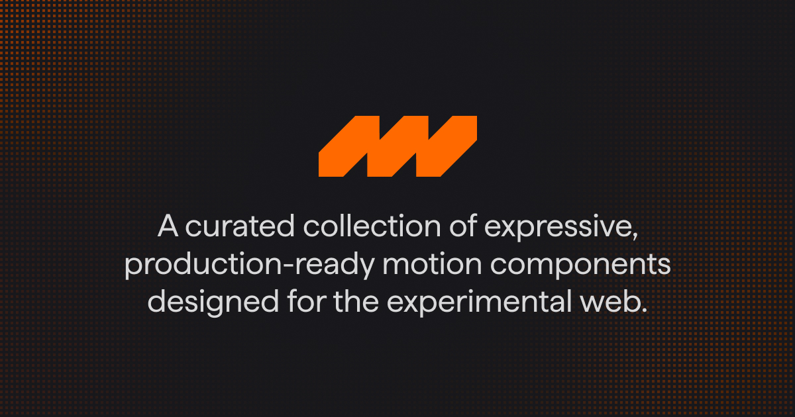

<div align="center">

[](LICENSE)
[](https://github.com/motion-core/motion-core/actions/workflows/coverage.yml)


</div>

---

## Overview

**Motion Core** is not just a library; it's a curated collection of expressive, production-ready motion components designed for the experimental web. Born from a desire to make high-end motion design accessible, it wraps complex WebGL and timeline-based animations into simple, developer-friendly Svelte 5 components.

We don't package everything into a massive npm dependency. Instead, we follow a **copy-paste architecture** (inspired by _shadcn/ui_). We encourage you to poke around the code, break things, and contribute back.

### Why Motion Core?

- **Svelte 5 Native**: Leverages Runes and Snippets for a truly reactive and modern DX.
- **Performance First**: Heavy lifting is done by GSAP and Three.js, ensuring buttery smooth 60fps experiences.
- **Aesthetic Focus**: From magnetic buttons to 3D infinite galleries with cloth distortion, every component is crafted with "feel" in mind.
- **The "Un-Library"**: Use our CLI to scaffold components directly into your codebase. No black boxes.

---

## Usage (For Developers)

The primary way to use Motion Core is via our CLI tool, which handles dependencies and scaffolding.

### 1. Initialization

Run the `init` command in your SvelteKit project to set up the environment, install base dependencies (like `clsx`, `tailwind-merge`), and configure your `motion-core.json`.

```bash
npx @motion-core/cli init
```

### 2. Adding Components

Browse the [documentation](https://motion-core.dev) to find a component you like, then add it to your project:

```bash
npx @motion-core/cli add infinite-gallery
npx @motion-core/cli add magnetic
```

This will download the component source code and place it in your configured components directory (default: `$lib/motion-core`).

---

## Monorepo Architecture

This repository is a **monorepo** managed by **Bun** and **Nx**. It houses the entire ecosystem:

- **`packages/motion-core`**: The source of truth for all components.
- **`apps/docs`**: The documentation site and development playground.
- **`motion-core-cli`**: The Rust-based CLI tool that powers the distribution.

### Prerequisites for Contributors

- **[Bun](https://bun.sh/)** (v1.3.3+) - _Strictly required for workspace management._
- **[Rust](https://www.rust-lang.org/)** (Latest) - _Required for CLI development._
- **Node.js** - _Required for certain internal tooling._

### Setting Up the Repo

1.  **Clone & Install**

    ```bash
    git clone https://github.com/motion-core/motion-core.git
    cd motion-core
    bun install
    ```

2.  **Bootstrap Workspace**
    This script generates the internal registry manifest and performs initial checks on the CLI.

    ```bash
    bun run workspace:bootstrap
    ```

3.  **Start Development**
    We use the documentation app as our dev environment to test components in real-time.
    ```bash
    bun run dev
    ```
    Open [http://localhost:5173](http://localhost:5173) to view the playground.

### CLI Development

If you are contributing to the CLI tool (written in Rust):

```bash
# Check for compilation errors
bun run cli:check

# Build the binary
bun run cli:build

# Run the test suite
bun run cli:test
```

---

## Contributing

We welcome contributions! Whether it's a new motion component, a bug fix, or a documentation improvement.

1.  Fork the repo.
2.  Create your feature branch (`git checkout -b feature/amazing-motion`).
3.  Commit your changes.
4.  **Lint & Format**: Run `bun run lint` and `bun run format`.
5.  Push to the branch and open a PR.

## License

Motion Core is open-source and free to use. Licensed under **MIT**.
